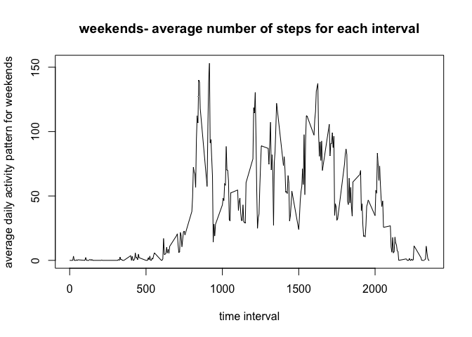

# Reproducible Research: Peer Assessment 1


## Loading and preprocessing the data

```r
library(lattice) 
library(ggplot2)

options(scipen=999)
activity <- read.csv("activity.csv")

## What is mean total number of steps taken per day?

# 1. Calculate the total number of steps taken per day
total_steps_per_day <- tapply(activity$steps, activity$date, sum, na.rm=TRUE)

# 2.  Make a histogram of the total number of steps taken each day
hist(total_steps_per_day)
```

 

```r
# 3. Calculate and report the mean and median of the total number of steps taken per day
mean_total_steps <- mean(total_steps_per_day)

median_total_steps <- median(total_steps_per_day)
```

Mean total steps is 9354.2295082 and median total steps is 10395

## What is the average daily activity pattern?

```r
average_daily_activity_pattern <- tapply(activity$steps, activity$interval, mean, na.rm=TRUE)

plot(names(average_daily_activity_pattern), average_daily_activity_pattern, type="l", xlab="time interval", ylab="average daily activity pattern", main="average number of steps for each interval")
```

 

```r
max_interval <- names(which.max(average_daily_activity_pattern))

max_steps <- max(average_daily_activity_pattern)
```

The 5-minute interval that, on average, contains the maximum number of steps is **835** with **206.1698113** steps.

## Imputing missing values
#### Note that there are a number of days/intervals where there are missing values (coded as NA). The presence of missing days may introduce bias into some calculations or summaries of the data.

1. The total number of missing values in the dataset (i.e. the total number of rows with NAs) is **2304** rows out of **17568** rows total.

2. Devise a strategy for filling in all of the missing values in the dataset. The strategy does not need to be sophisticated. For example, you could use the mean/median for that day, or the mean for that 5-minute interval, etc.

#### The strategy I chose was to use the average for the day when ignoring NAs, or use 0 if the whole day was NA.


```r
# get day means
day_means <- tapply(activity$steps, activity$date, mean, na.rm=TRUE)

# add in zeroes 
new_day_means <- replace(day_means, is.na(day_means), 0)

#split up data by day
split_days <- split(activity, activity$date)

# replace with the earlier calculated means
for(i in 1:length(split_days))
{
  split_days[[i]] <- replace(split_days[[i]], is.na(split_days[[i]]), new_day_means[[i]] )

}
```

3. Create a new dataset that is equal to the original dataset but with the missing data filled in.


```r
new_activity <- unsplit(split_days, activity$date)
```

4. Make a histogram of the total number of steps taken each day and Calculate and report the mean and median total number of steps taken per day. Do these values differ from the estimates from the first part of the assignment? What is the impact of imputing missing data on the estimates of the total daily number of steps?


```r
# 1. Calculate the total number of steps taken per day
new_total_steps_per_day <- tapply(new_activity$steps, new_activity$date, sum)

# 2.  Make a histogram of the total number of steps taken each day
hist(new_total_steps_per_day)
```

 

```r
# 3. Calculate and report the mean and median of the total number of steps taken per day
new_mean_total_steps <- mean(new_total_steps_per_day)

new_median_total_steps <- median(new_total_steps_per_day)
```

Mean total steps for the new data is 9354.2295082 and median total steps is 10395. There wasn't a change from previously when 9354.2295082 was mean total steps and  10395 was median total steps.


## Are there differences in activity patterns between weekdays and weekends?

#### 1. Create a new factor variable in the dataset with two levels – “weekday” and “weekend” indicating whether a given date is a weekday or weekend day.


```r
#find which days are weekend or weekdays
days <- as.POSIXlt(new_activity$date)$wday
days_bool <- (days == 0) | (days == 6)

#add the daytype factor
new_activity[, "daytype"] <- factor(ifelse(days_bool,"weekend","weekday"))
```

#### 2. Make a panel plot containing a time series plot (i.e. type = "l") of the 5-minute interval (x-axis) and the average number of steps taken, averaged across all weekday days or weekend days (y-axis).


```r
split_day_type <- split(new_activity, new_activity$daytype)

average_daily_activity_pattern_weekdays <- tapply(split_day_type$weekday$steps, split_day_type$weekday$interval, mean, na.rm=TRUE)
average_daily_activity_pattern_weekends <- tapply(split_day_type$weekend$steps, split_day_type$weekend$interval, mean, na.rm=TRUE)

plot(names(average_daily_activity_pattern_weekdays), average_daily_activity_pattern_weekdays, type="l", xlab="time interval", ylab="average daily activity pattern for weekdays", main="weekdays- average number of steps for each interval")
```

 

```r
plot(names(average_daily_activity_pattern_weekends), average_daily_activity_pattern_weekends, type="l", xlab="time interval", ylab="average daily activity pattern for weekends", main="weekends- average number of steps for each interval")
```

 

